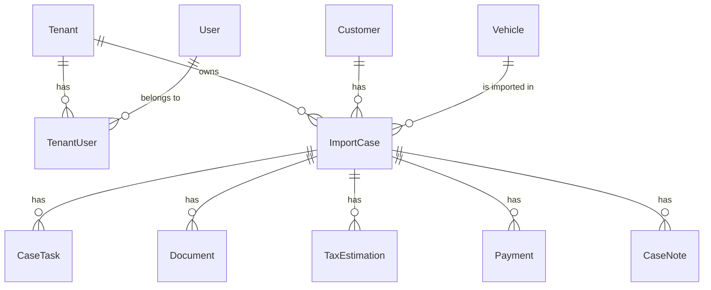

# 🏗️ Arquitetura da Plataforma

Este documento descreve a arquitetura técnica, decisões de design e fluxos principais da plataforma.

## 📐 Visão Geral

A plataforma é construída como um **monorepo** usando **pnpm workspaces** e **Turbo**, com arquitetura serverless baseada integralmente em **Supabase**.

```
┌─────────────────────────────────────────────────────────┐
│                     Frontend (Next.js 14)                │
│  ┌─────────────┐  ┌──────────────┐  ┌───────────────┐  │
│  │   Pages/    │  │  Components  │  │  TanStack     │  │
│  │   App Router│  │  (shadcn/ui) │  │  Query        │  │
│  └─────────────┘  └──────────────┘  └───────────────┘  │
└────────────────────────┬────────────────────────────────┘
                         │
                         │ Supabase Client
                         │
┌────────────────────────┴────────────────────────────────┐
│                    Supabase Backend                     │
│  ┌──────────────┐  ┌──────────────┐  ┌──────────────┐  │
│  │ PostgreSQL   │  │ Auth (GoTrue)│  │ Storage      │  │
│  │ + RLS        │  │ Multi-provider│  │ (documents)  │  │
│  └──────────────┘  └──────────────┘  └──────────────┘  │
│  ┌──────────────┐  ┌──────────────┐  ┌──────────────┐  │
│  │ Realtime     │  │ Edge Functions│  │ PostgREST    │  │
│  │ (websockets) │  │ (Deno)       │  │ (API)        │  │
│  └──────────────┘  └──────────────┘  └──────────────┘  │
└─────────────────────────────────────────────────────────┘
```

## 🗂️ Estrutura do Monorepo

```
plataforma-importacao-ligeiros/
├── apps/
│   ├── web/              # Next.js 14 (App Router)
│   │   ├── src/
│   │   │   ├── app/      # Pages & layouts
│   │   │   ├── components/
│   │   │   ├── lib/      # Utils, Supabase clients
│   │   │   └── hooks/    # React hooks
│   │   └── public/
│   └── api/              # NestJS (opcional, serviços de domínio)
├── packages/
│   ├── types/            # Schemas Zod + TypeScript types
│   ├── ui/               # Componentes partilhados (shadcn/ui)
│   └── config/           # ESLint, TypeScript configs
├── supabase/
│   ├── migrations/       # SQL migrations
│   ├── functions/        # Edge Functions (Deno)
│   ├── config.toml       # Configuração local
│   └── seed.sql          # Dados de exemplo
└── .github/
    └── workflows/        # CI/CD
```

## 🎯 Princípios de Design

### 1. **Backend-as-a-Service (BaaS)**
- **Supabase** como único backend
- Sem servidor Node.js tradicional
- Edge Functions para lógica complexa
- Row-Level Security (RLS) para isolamento de dados

### 2. **Type Safety**
- TypeScript em todo o stack
- Zod para validação runtime
- Tipos gerados do schema Supabase
- Type-safe API com TanStack Query

### 3. **Multi-Tenancy**
- Isolamento por `tenant_id`
- RLS policies baseadas em tenant
- Utilizadores podem pertencer a múltiplos tenants
- RBAC (Role-Based Access Control) via `TenantUser`

### 4. **Auditoria & Compliance**
- Log completo de todas as ações (`AuditLog`)
- Tracking de alterações (old_values, new_values, diff)
- Imutabilidade dos logs (apenas INSERT)
- Integração com eventos externos (`IntegrationEvent`)

### 5. **Realtime & Reactive**
- Supabase Realtime para atualizações instantâneas
- TanStack Query para cache otimizado
- Invalidação automática de cache
- Optimistic updates

## 🔐 Segurança

### Row-Level Security (RLS)

Todas as tabelas principais têm RLS ativo:

```sql
-- Exemplo: ImportCase
CREATE POLICY "users_view_own_tenant_cases"
ON "ImportCase" FOR SELECT
USING (
  tenant_id IN (
    SELECT tenant_id FROM "TenantUser"
    WHERE user_id = auth.uid() AND is_active = true
  )
);
```

### Autenticação

- **Supabase Auth** (JWT-based)
- Suporte multi-provider:
  - Email/Password
  - Magic Link
  - OAuth (Google, Microsoft, GitHub)
- Refresh tokens automáticos
- Session management via cookies (SSR-safe)

### Storage Security

- Buckets com RLS
- Paths estruturados: `{tenant_id}/{case_id}/{filename}`
- Signed URLs para downloads temporários
- Validação de mime-types

## 🗃️ Modelo de Dados

### Entidades Core



### Fluxo de Estado (ImportCase)

```
INTAKE
  ↓
DOCS_PENDING
  ↓
DOCS_VERIFICATION
  ↓
CUSTOMS_DECLARATION
  ↓
ISV_CALCULATION ←── (Edge Function: calculate-isv)
  ↓
INSPECTION_B
  ↓
IMT_REGISTRATION
  ↓
REGISTRY
  ↓
PLATES_ISSUED
  ↓
COMPLETED
```

Estados alternativos: `ON_HOLD`, `REJECTED`

## ⚡ Edge Functions

### calculate-isv

**Input:**
```json
{
  "caseId": "uuid",
  "engineCapacity": 1600,
  "co2Emissions": 125,
  "vehicleAgeMonths": 24,
  "vehicleValue": 15000,
  "fuelType": "GASOLINE"
}
```

**Output:**
```json
{
  "success": true,
  "data": {
    "estimationId": "uuid",
    "isvCilindrada": 1234.56,
    "isvCo2": 2345.67,
    "isvTotal": 3580.23,
    "reductionPercentage": 24,
    "isvFinal": 2721.00,
    "ivaAmount": 4085.83,
    "iucEstimated": 69.72,
    "totalEstimatedCost": 21876.55
  }
}
```

**Lógica:**
1. Busca tabelas fiscais ativas (`TaxTable`)
2. Calcula componente cilindrada (€/cc)
3. Calcula componente ambiental (CO₂)
4. Aplica redução por antiguidade (1%/mês, max 50%)
5. Calcula IVA (23% sobre base)
6. Estima IUC anual
7. Salva em `TaxEstimation`
8. Cria registo de auditoria

### generate-pdf

Gera documentos PDF (orçamentos, declarações, recibos) usando templates HTML.

**Input:**
```json
{
  "type": "ORCAMENTO",
  "caseId": "uuid",
  "locale": "pt-PT"
}
```

**Output:**
```json
{
  "success": true,
  "data": {
    "fileName": "orcamento_IMP-2024-001234_1703012345678.pdf",
    "filePath": "tenant_id/exports/...",
    "downloadUrl": "https://...signed-url..."
  }
}
```

### vin-decoder

Decode VIN e enriquece dados do veículo (mock para demonstração).

## 🔄 Fluxos Principais

### 1. Criar Processo de Importação

```typescript
// 1. Cliente cria/seleciona Customer
const customer = await createCustomer({ ... });

// 2. Decode VIN (Edge Function)
const vehicleData = await decodeVIN(vin);

// 3. Cria Vehicle
const vehicle = await createVehicle(vehicleData);

// 4. Cria ImportCase
const importCase = await createImportCase({
  customerId: customer.id,
  vehicleId: vehicle.id,
  purchasePrice: 15000,
  ...
});

// 5. Tarefas iniciais criadas automaticamente (trigger)
// 6. Notificação enviada ao operador atribuído
```

### 2. Workflow de Documentos

```typescript
// 1. Upload de documento
const doc = await uploadDocument({
  caseId,
  type: 'INVOICE',
  file: File
});

// 2. Storage: tenant_id/case_id/filename
// 3. Registo criado em Document (status: UPLOADED)

// 4. Verificação por operador
await verifyDocument(docId, { approved: true });

// 5. Status atualizado (APPROVED)
// 6. Tarefa de verificação marcada como COMPLETED
// 7. Notificação ao cliente (opcional)
```

### 3. Cálculo de Impostos

```typescript
// 1. Operador solicita cálculo
const result = await calculateISV({
  caseId,
  engineCapacity: vehicle.engineCapacity,
  co2Emissions: vehicle.co2Emissions,
  vehicleAgeMonths: calculateAge(vehicle.firstRegistrationDate),
  vehicleValue: importCase.purchasePrice,
  fuelType: vehicle.fuelType
});

// 2. Edge Function calcula e salva em TaxEstimation
// 3. ImportCase.status → ISV_CALCULATION
// 4. Geração automática de Payment records
// 5. Notificação ao cliente com orçamento
```

## 🧩 Componentes Principais

### Frontend Architecture

```
app/
├── (auth)/               # Auth layout
│   └── login/
├── (dashboard)/          # Main app layout
│   ├── dashboard/
│   ├── processos/
│   │   ├── page.tsx      # Lista
│   │   ├── [id]/         # Detalhe
│   │   └── novo/         # Criar
│   ├── clientes/
│   ├── veiculos/
│   └── configuracoes/
└── api/                  # API routes (Next.js)
    └── webhooks/
```

### Layouts & Nesting

```tsx
app/
├── layout.tsx            # Root: Providers, Toaster
└── (dashboard)/
    ├── layout.tsx        # Sidebar, Header, Auth check
    └── processos/
        ├── layout.tsx    # Breadcrumbs
        └── [id]/
            └── layout.tsx # Tabs navigation
```

### Data Fetching Strategy

```tsx
// Server Component (initial data)
async function ProcessoPage({ params }: { params: { id: string } }) {
  const supabase = createClient();
  const { data } = await supabase
    .from('ImportCase')
    .select('*, customer:Customer(*), vehicle:Vehicle(*)')
    .eq('id', params.id)
    .single();

  return <ProcessoClient initialData={data} />;
}

// Client Component (realtime updates)
'use client';
function ProcessoClient({ initialData }) {
  const { data } = useImportCase(initialData.id, initialData);
  
  useEffect(() => {
    const channel = supabase
      .channel(`case:${data.id}`)
      .on('postgres_changes', { 
        event: '*', 
        schema: 'public', 
        table: 'ImportCase',
        filter: `id=eq.${data.id}`
      }, (payload) => {
        queryClient.invalidateQueries(['case', data.id]);
      })
      .subscribe();

    return () => { channel.unsubscribe(); };
  }, [data.id]);

  return <ProcessoView data={data} />;
}
```

## 🚀 Performance

### Optimizações

1. **Server Components por default** (Next.js 14)
2. **Streaming SSR** para dados lentos
3. **TanStack Query cache** com staleTime apropriado
4. **Realtime subscriptions** apenas onde necessário
5. **Edge Functions** geo-distribuídas (Deno Deploy)
6. **CDN** para assets estáticos (Vercel)
7. **Indexed queries** em todas as foreign keys
8. **Materialized views** para dashboards (futuro)

### Monitoramento

- Supabase Dashboard (queries lentas, RLS performance)
- Vercel Analytics (Core Web Vitals)
- Error tracking via Sentry (futuro)
- Logs centralizados (`AuditLog`, `IntegrationEvent`)

## 🔮 Roadmap Técnico

### Fase 2
- [ ] Testes E2E com Playwright
- [ ] Testes unitários (Jest) para Edge Functions
- [ ] Storybook para componentes UI
- [ ] Webhook handlers para integrações reais

### Fase 3
- [ ] Portal do cliente (public pages)
- [ ] App móvel (React Native + Expo)
- [ ] Integrações reais (IMT, Alfândega)
- [ ] OCR real com Tesseract/Google Vision

### Fase 4
- [ ] Multi-região (Supabase)
- [ ] IA para sugestões de documentos
- [ ] Marketplace de despachantes
- [ ] API pública para parceiros

---

**Última atualização:** 2024-10-23  
**Versão:** 1.0.0


